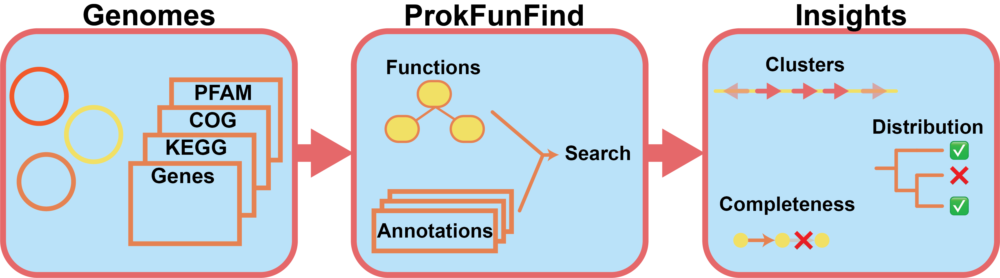

.. ProkFunFind documentation master file, created by
   sphinx-quickstart on Fri Jul 24 19:50:07 2020.
   You can adapt this file completely to your liking, but it should at least
   contain the root `toctree` directive.

#######################################
Welcome to ProkFunFind's documentation!
#######################################
ProkFunFind is a pipeline that can be used to predict genes related to function of interest.
Criteria for function detection include presence of detected genes, and genomic co-localization.

In order to identify genes using ProkFunFind, the user needs:

#. Select the correct search approaches and filtering paramters to identify your genes of interest

   #. Protein sequences

   #. Profile HMMs

   #. COGs

   #. KOs

   #. Protein domain signatures

#. Define the gene components for the function system in JSON format

   #. Define the essential and non essential components of the overall function of interest.

#. Perform the search for the functions in your genomes of interest using ProkFunFind

#. Analyze the search results

  #. Assess completness of function in different organisms

  #. Identify potential gene clusters

  #. Analyze species distribution

.. toctree::
   :maxdepth: 2
   :caption: Contents:
   :glob:

   installation
   quickstart
   inputs
   outputs
   ebi-genomes
   tutorial/1-intro
