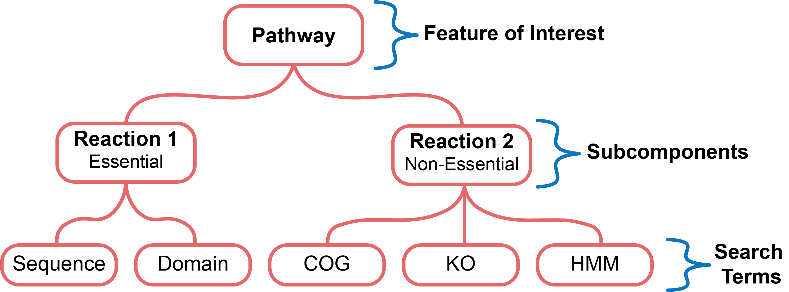

# Queries and Search Genomes

This tutorial section will cover how to format the queries and the
information for the genomes that you are going to search.

## Queries

The query format used by *ProkFunFind* is designed around the concept of what we
refer to as a *feature model*. This feature model is a collection of search
terms that are associated with a biological function of interest. These terms
are organized into a hierarchical structure that is used to represent the relationships between different components of the biological system.

The tutorial materials for this section are located in the
{tutorial-materials}/1-queries/ directory.

### Types of Search Terms
*ProkFunFind* supports multiple types of queries and additional support for new search approaches is actively being worked on.

You can perform searches using *ProkFunFind* with the following kinds of
search terms:

| Type of Search | Search Term |
|----------------|-------------|
| Protein Sequence | Amino Acid Sequence |
| Hidden Markov Model | Protein Profile HMMs |
| Protein Domains | Supported domains predicted by InterProScan (SEE: [InterProScan]). Including Pfam and TIGRFAM|
| Ortholog Groups | Kegg Orthology (KO) and Clusters of Orthologous Groups (COGs) |

[InterProScan]: https://interproscan-docs.readthedocs.io/en/latest/HowToRun.html#included-analyses

Multiple queries can be associated with a single search term ID. For example
one component of your feature can be associated with multiple protein sequences,
a COG, ID, and a set of protein domains. These IDs are linked to the individual
search terms names through a two column table. This table can be seen in the
`search-term.tsv` file:

```
  enzyme1	Sequence1	blast
  enzyme1	PF07969	interproscan	1
  enzyme2	Profile1	hmmer
  enzyme2	COG0670	emapper
  enzyme2	K00554	kofamscan
```
This input table must have three columns, with an optional fourth column. The
first column specifies the search term ID, the second column specifies the
query associated with the search term, and the third column specifies the
search approach (blast for sequences, hmmer for profile HMMs, interproscan for
protein domains, emapper for COGs, or kofamscan for KOs). The last column can
be used to specify the domain precision *****


### Feature Model Definition
The search terms in *ProkFunFind* are organized in a hierarchical representation
of the biological function. A visual representation of this can be seen here:



At the highest level of this organization is the overall biological feature
that you want to search for. This would typically be something like a biological
pathway or an enzyme complex, but this structure can be used to represent any
collection of features.

The overall feature is broken up into subcomponents. These can be any groupings
that you want to use to organize your search terms. An example of a subcomponent
of a metabolic pathway would be an enzyme complex that catalyzes one of the
metabolic reactions. This format is also flexible, allowing for the Definition
of multiple levels of subcomponents.

The subcomponents of a feature are ultimately associated with one or more
search term IDs. When a search is performed using *ProkFunFind* the presence
or absence of a the feature is assessed based on the specified essentiality
and what search terms were detected in the search.

The feature model is provided to the *ProkFunFind* pipeline as a JSON formatted
file. An example of a feature model input for the toy example in the above
image can be seen in the `systems.json` file:

```
  {
      "name": "Pathway",
      "components": [
          {
              "name": "Reaction1",
              "presence": "essential",
              "components": [
                  {
                      "orthoID": "enzyme1",
                      "description": "Enzyme catalyzes Reaction1",
                      "presence": "essential"
                  }
              ]
          },
          {
              "name": "Reaction2",
              "presence": "nonessential",
              "components": [
                  {
                      "orthoID": "enzyme2",
                      "description": "Enzyme catalyzes Reaction2",
                      "presence": "essential"
                  }
              ]
          }
      ]
  }
```
This is just a toy example meant to show the format, but more complex
relationships can be represented as well. Examples of a more complex feature
model can be seen in the `systems-complex.json` file and additional examples
can also be seen in the other tutorial sections ({doc}`Sequence Searches <4-seqsearch>`
and {doc}`Annotation Searches<5-annotsearch>`).

## Search Configuration


## Search Space
