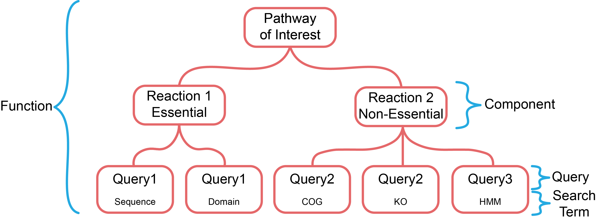

**************************
Queries and Search Genomes
**************************

This tutorial section will cover how to format the queries and the
information for the genomes that you are going to search.

Queries
#######

The query format used by *ProkFunFind* is designed around the concept of what we
refer to as a *feature model*. This feature model is a collection of search
terms that are associated with a biological function of interest. These terms
are organized into a hierarchical structure that is used to represent the
relationships between different components of the biological system.

The tutorial materials for this section are located in the
./queries/ directory.

Feature Model Definition
**************************
The feature model is defined in the second portion of the central `config.yaml`
configuration file. The feature model definition is provided in yaml format. This
definition is where the function organization is defined and where each gene
in the function is associated with search terms. An example of a function
definition can be seen in the `queries/examples/config.yaml` example file:

.. code-block::

  ---
  name: Equol Gene Cluster
  components:
  - name: Equol Production Pathway
    presence: essential
    components:
    - geneID: DZNR
      description: Daidzein reductase
      presence: essential
      terms:
      - id: DZNR
        method: hmmer
    - geneID: DHDR
      description: Dihydrodaidzein reductase
      presence: essential
      terms:
      - id: GCF_000422625.1_00043
        method: blast
        ident_pct: 90
    - geneID: THDR
      description: Tetrahydrodaidzein reductase
      presence: essential
      terms:
      - id: COG1053
        method: emapper
        evalue: 0.001
    - geneID: DDRC
      description: Dihydrodaidzein racemase
      presence: essential
      terms:
      - id: DDRC
        method: hmmer

The feature definition is organized as a series of nested components. The outermost
component is the overall function definition. In the example above that would
be the 'Equol Gene Cluster'. The function is then organized in a nested structure
with subcomponents that are ultimately associated with search terms. Each of these
portions of the feature will be explained in the subsequent sections.

Types of Search Terms
**********************
*ProkFunFind* supports multiple types of queries and additional support for new search approaches is actively being worked on.

You can perform searches using *ProkFunFind* with the following kinds of
search terms:

=====================   ========================================================
Type of Search          Search Term
=====================   ========================================================
Protein Sequence        Amino Acid Sequence
---------------------   --------------------------------------------------------
Hidden Markov Model     Protein Profile HMMs
---------------------   --------------------------------------------------------
Protein                 Domains Supported domains predicted by InterProScan
                        (SEE: `InterProScan`_). Including Pfam and TIGRFAM
---------------------   --------------------------------------------------------
Ortholog Groups         Kegg Orthology (KO) and Clusters of
                        Orthologous Groups (COGs)
=====================   ========================================================

.. _InterProScan: https://interproscan-docs.readthedocs.io/en/latest/HowToRun.html#included-analyses

Multiple search terms can be associated with a single geneID through the terms
property in the yaml function definition.

.. code-block::

  - geneID: THDR
    description: Tetrahydrodaidzein reductase
    presence: essential
    terms:
    - id: COG1053
      method: emapper
      evalue: 0.001
    - id: GCF_000422625.1_00043
      method: blast
      ident_pct: 90

Search Configuration
####################
The configuration file is where all of the search parameters are defined. This
central file should be named 'config.yaml'. This file is broken up into different
sections where filtering thresholds and file naming patterns are defined. An
example of a config.ini file can be found in the `config.yaml` file in the examples
directory.

.. code-block::

    ---
    main:
      cluster_tool: DBSCAN
      faa_suffix: .faa
      gff_suffix: .gff
      fna_suffix: .fna
    DBSCAN:
      cluster_eps: 4
      cluster_min_samples: 2
    hmmer:
      hmmer_query: query.hmm
      hmmer_exec: hmmscan
      hmmer_threads: 1
      evalue: 1e-3
    blast:
      blast_query: query.fa
      blast_exec: blastp
      blast_threads: 1
      evalue: 1e-3
    kofamscan:
      annot_suffix: .kofam.tsv
      threshold: 0.5
    emapper:
      annot_suffix: .emapper.annotations
    interproscan:
      annot_suffix: _InterProScan.tsv

The 'main' section is used to provide the file extensions for the genome
input files. This section is also used to set
the clustering tool used to identify if the hits from the search are found in
any clusters within the genome. Currently on the DBSCAN algorithm is supported
for gene clustering.

The 'DBSCAN' section is used to set the parameters used in the DBSCAN clustering
to determine if multiple genes are present in the same clusters in the genome.
The 'clsuter.eps' setting is used to set how far two observations can be while
still being considered to be in the same cluster. the 'cluster.min_samples'
parameter is used to determine how many genes must be in the same region for
them to be considered a cluster. See
`DBSCAN <https://scikit-learn.org/stable/modules/generated/sklearn.cluster.DBSCAN.html>`_
for more information on the DBSCAN implementation.

The other sections defined in the configuration file are search approach
specific. These sections are used to define the file extensions for the
annotation or query files as well as the filtering parameters for each search
approach. See the other search specific tutorial sections for examples and the
'inputs' section of the documentation for a complete table of all settings
allowed for each search approach.

Search Space
##############
The last component of the `ProkFunFind` approach is the genomes being searched.
The set of information needed for each genome depends on what kinds of searches
are being performed. At minimum each genome needs a genome fasta file, a GFF
file containing the predicted genes, and a protein fasta file of the predicted
protein sequences. With just this information searches can be performed using
BLAST or HMMER. To search using additional features, files containing the results
of running EGGNog-mapper, InterProScan, or KOfamscan also need to be present. See
the :doc:`Inputs <../inputs>` and :doc:`PFA Tutorial <./7-pfa>` sections for more information on these
annotation formats and the ProkFunAnnotate pipeline that can be used to generate
them.
